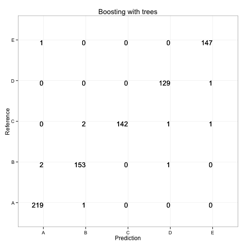
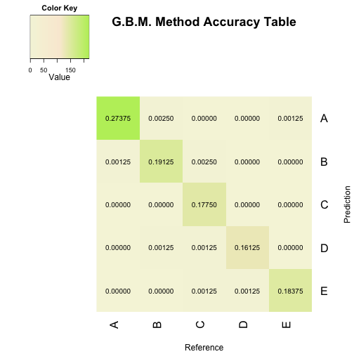

# Machine Learning Project: Weight Lifting Exercise
========================================================
## Background

Using devices such as Jawbone Up, Nike FuelBand, and Fitbit it is now possible to collect a large amount of data about personal activity relatively inexpensively. These type of devices are part of the quantified self movement – a group of enthusiasts who take measurements about themselves regularly to improve their health, to find patterns in their behavior, or because they are tech geeks. One thing that people regularly do is quantify how much of a particular activity they do, but they rarely quantify how well they do it. In this project, your goal will be to use data from accelerometers on the belt, forearm, arm, and dumbell of 6 participants. They were asked to perform barbell lifts correctly and incorrectly in 5 different ways. More information is available from the website here: [http://groupware.les.inf.puc-rio.br/har](http://groupware.les.inf.pucrio.br/har) (see the section on the Weight Lifting Exercise Dataset). 

## 1. Summary

Six young health participants were asked to perform one set of 10 repetitions of the Unilateral Dumbbell Biceps Curl in five different fashions: exactly according to the specification (Class A), throwing the elbows to the front (Class B), lifting the dumbbell only halfway (Class C), lowering the dumbbell only halfway (Class D) and throwing the hips to the front (Class E). Class A corresponds to the specified execution of the exercise, while the other 4 classes correspond to common mistakes.

The goal of this project is to predict the manner in which they did the exercise. This is the "classe" variable in the training set. We use other variables to predict with. This is a report describing how model was built, how cross validation was used, what is expected out of sample error.

The data for this project come from [http://groupware.les.inf.puc-rio.br/har](http://groupware.les.inf.pucrio.br/har), a paper published by:

Velloso, E.; Bulling, A.; Gellersen, H.; Ugulino, W.; Fuks, H. **Qualitative Activity Recognition of Weight Lifting Exercises**. Proceedings of 4th International Conference in Cooperation with SIGCHI (Augmented Human '13). Stuttgart, Germany: ACM SIGCHI, 2013.

We applied Boosting with trees prediction method, with an expected **Out of Sample Error** of approximately **1.4%**. 

## 2. Data Processing

For trining and testing we use random subset of about 20% the original data. The original data can be found at [https://d396qusza40orc.cloudfront.net/predmachlearn/pml-training.csv](https://d396qusza40orc.cloudfront.net/predmachlearn/pml-training.csv).

Subsetting the data is useful as it prevents overfitting of prediction model to the training sample and saves times, especially for mor advanced, computationaly expensive models.
 

```r
#Please set working directory and insert training and testinf giles in it (pml-training.csv, pml-testing.csv).
```

              

```r
#Load required packages

require(caret)
require(kernlab)
require(reshape2)
require(rpart)
require(gbm)
require(survival)
require(splines)
require(parallel)
require(plyr)
require(MASS)
require(klaR)
require(gplots)
require(randomForest)
require(gridExtra)

#Read the data
trainfilename<- "pml-training.csv"
testfilename <- "pml-testing.csv"
wle<-read.csv(trainfilename, header=T, as.is=T)
origtest <- read.csv(testfilename,header=T)
```

For testing purposes, a set of test data was been provided. We used this test dataset to figure out how to clean the data that we would use to train our predictive models.


```r
# Set the seed, for reproducible research
set.seed(4321)

# Remove columns filled only with NA values
nonatest<- origtest[,!(apply(is.na(origtest[,colnames(origtest)]),2,all))]

# Remove columns which are not of type Factor or Logical (exclude character or date columns)
wletest<- nonatest[!(sapply(nonatest,is.factor)+sapply(nonatest,is.logical))]

# Remove the last column the column - the results
wletest<- wletest[,-1]

# Find out which are the remaining columns in the test dataset
# and keep only the same columns in the training dataset
train_col_names<- colnames(wletest[,-ncol(wletest)])
origtrain<-read.csv(trainfilename,header=T)
wletrain<-origtrain[,train_col_names]

#Append the results column to the training dataset
wletrain$classe<-origtrain$classe

# As a precaution, keep only the rows with no NA values in the training dataset
nonawle <- wletrain[complete.cases(wletrain),]
```

After preprocessing the data, we created a random subset of approximatelly 20% of the original data - 4000 cases. This random subset was then split into three parts:
- training dataset (60%)
- cross validation dataset (20%) 
- test dataset (20%).

Having a training dataset and a cross validation dataset allowes us to train our models on the training dataset and then compare them by applying them on a new, unused, differnet dataset. This way we made sure that the comparison was done properly and that overfitting did not affect our results. 
The third (testing) dataset was used to compute the Out of Sample error. Use of a different dataset than the cross validation set is necessary, because using the cross validation set was bound to produce the best results, since all comparisons were done using that set.


```r
# Randomly subset approximately the 20% of the cleaned data
rand<-sample(nrow(nonawle),4000)
randwle <- sample(nonawle[rand,])

# Split the subsetted dataset into a training, a cross validation and a test set
# in a 60% / 20% / 20% ratio
dataidx<- createDataPartition(y=randwle$classe,p=0.6,list=F)
wletr<-randwle[dataidx,]
tsttemp<-randwle[-dataidx,]
tstidx<-createDataPartition(y=tsttemp$classe,p=0.5,list=F)
wlecv<-tsttemp[tstidx,]
wletst<-tsttemp[-tstidx,]
```

## 3. Applying Boosting with trees model.

The basic idea behind boosting is:
- take lots of (possibly) weak predictors (as in the case of this dataset)
- weight them and add them up
- get a stronger predictor

Boosting models are one of the most common tools that win Kaggle and other prediction contests. We use G.B.M (Boosting with trees) from the R **caret** package.


```r
# train the model

gbmfit<-train(classe~.,data=wletr,method="gbm",verbose=F)
```
We apply the trained model to the cross validation set and examin the result.


```r
#Predict outcome based on the cross validation data

gbmpred<-predict(gbmfit,wlecv)

#Create the Confusion Matrice

modgbm<-confusionMatrix(wlecv$classe,gbmpred)
```

## 4. Interpreting the results

In order to interpret the results, we plot the accuracy matrice for our model.


```r
gbmmelt<-melt(modgbm$table)

#custom plotting function
modtabplot<- function(data,maintitle){
  tabplot<-ggplot(data, aes(x = Prediction, y = Reference,label=value))+geom_text(size=5, hjust = 1, vjust = 1)
  tabplot<-tabplot+geom_text(size=5, hjust = 1, vjust = 1)
  tabplot<-tabplot+theme_bw()
  tabplot<-tabplot+ggtitle(maintitle)
  return(tabplot)
}

#create plot

gbmplot<-modtabplot(gbmmelt, "Boosting with trees")
 
gbmplot
```

 

Inspecting the plot reveals that the model produced only small amount of prediction errors, which is a very satisfactory result. 
### Accuracy of the G.B.M. model:


```r
print(modgbm$overall[1])
```

```
## Accuracy 
##   0.9875
```

The accuracy rate of the **B.G.M** model for each exercise class can be viewed in the following figure:


```r
my_color<- colorRampPalette(c("beige","antiquewhite","darkolivegreen2"))(n = 1000)
accuracyrate<-format((modgbm$table/sum(modgbm$table)),digits=4)
heatmap.2(modgbm$table,cellnote=accuracyrate,col=my_color,Rowv=NA,dendrogram="none",symm=T,scale="none",
          density.info="none",trace="none",notecol="black",
          main=paste("G.B.M. Method","Accuracy Table",sep=" "), ylab="Prediction", xlab="Reference")
```

 

## 5. Expected Out Of Sample Error.

We use the test dataset (unused so far) to estimate the expected out of sample error of the model. We apply our chosen method to the test dataset and examin the accuracy estimation. 


```r
model_test<- predict(gbmfit,wletst)
model_matrix<-confusionMatrix(wletst$classe,model_test)
#model accuracy
print(model_matrix$overall[1])
```

```
## Accuracy 
##   0.9862
```

```r
# Expected Out Of Sample Error.
outerr<- 1-model_matrix$overall[1]
print(as.numeric(outerr))
```

```
## [1] 0.01377
```

### The error expressed as *1-accuracy* for our G.B.M model is estimated to be (based on the test dataset):  **Out of Sample error** ~ **0.0138**.

## 6. Test on the pml-testing.csv

Test on the set of 20 cases from pml-testing.csv resulted in **20/20 accuracy** of our prediction from the G.B.M model.

